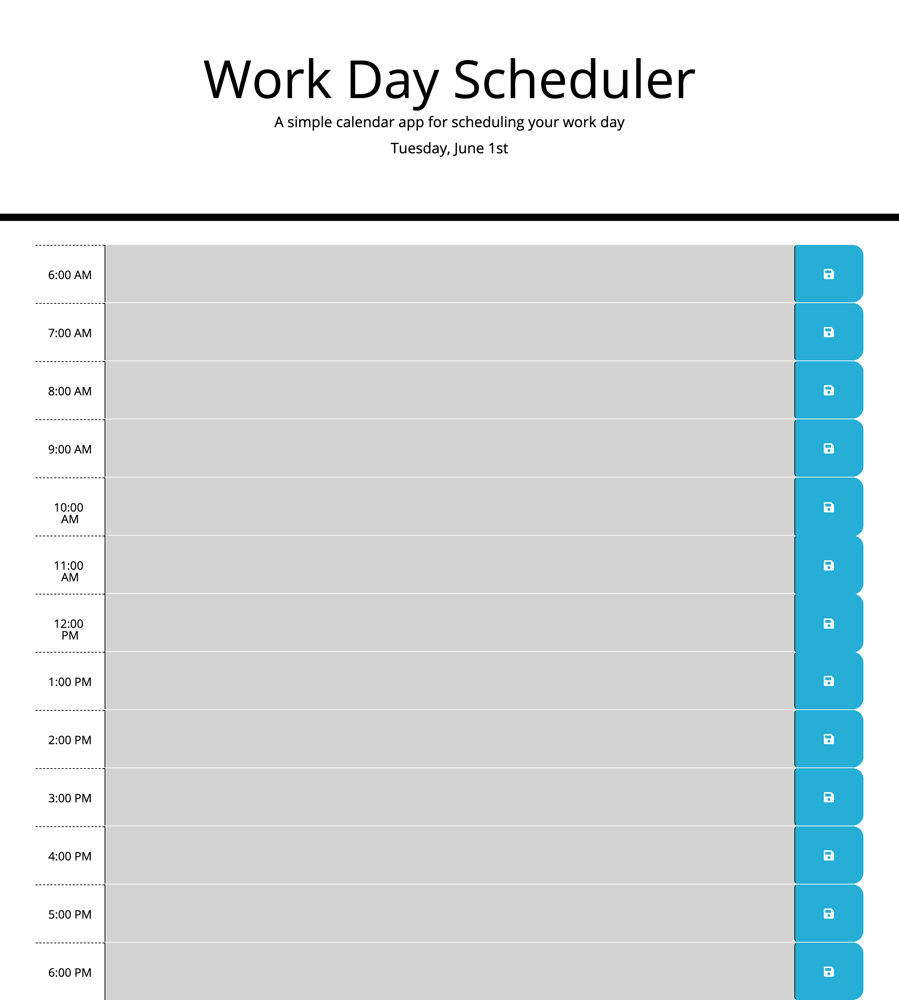

# Work Day Scheduler

## Description

I created a simple calendar application that allows a user to save events for each hour of the day by modifying starter code. Here's how this application works:
1. When the user opens the scheduler, the current date day is displayed at the top of the page.
2. When the user scrolls, they're presented with one-hour time blocks.
3. Each time block is color-coded to indicated whether it is in the past (grey), present (red), or future (green).
4. When the user clicks in a time block, they can add an event.
5. When the user clicks the blue save button, their event text is saved to localStorage.

Link to live webpage: [Work Day Scheduler](#)

## Screenshot

## Technologies Used

- HTML
- CSS
- JavaScript
- jQuery
- Bootstrap